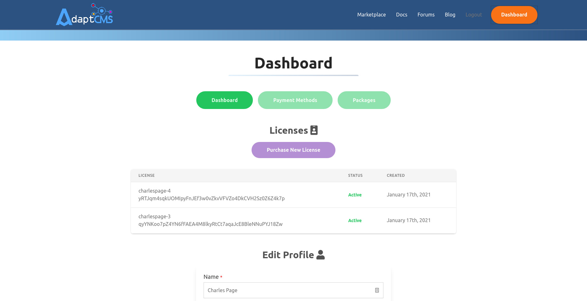

# Installation

## Setup

After ensuring your web server meets the requirements, you will also need NPM/Yarn installed, as well as composer:

```text
composer require adaptcms/cms
```

After composer is finished, enter the `adaptcms` directory and modify your `.env` file with your database credentials, mail, anything that you see that you can enter credentials, or to choose drivers.

Next, run npm/yarn and composer to install the dependencies:

```text
yarn OR npm install
composer install
```

When running composer you will be asked for a username and password. Login to the [AdaptCMS website](https://www.adaptcms.com) and go to your dashboard. Once a license has been purchased you will see two lines listed per license. The first line is the username, the long random string below is the password.



After composer is completed, copy the `.env.example` file to `.env`. Open up this new file and enter in your configuration, such as database info. Next, run this command to trigger the initial install, as well as setting up your first admin account:

```text
php artisan cms:install
```

If you're looking for a new web host, by the way, we highly recommend [**DigitalOcean**](https://m.do.co/c/083895eaa907)!


## Permissions

We know setting permissions sucks, but one day we sat down and found a good set that worked for us very well. In the root folder, there is a `laravel_permissions.sh` file that you can run. Please note before running this command to ensure your apache/nginx username matches `www-data` in the file, and to either create or edit the group name `dev` that is in the file. We've found having a properly set up user with group permissions to be a big key to getting everything working right.

If you are unsure of how to handle group management in the command line, we have a tutorial setup on this. Note in the example the group name being used is `dev`, but that name can be quickly replaced in the permissions bash file:



If you choose not to run this bash file, keep in mind that read/write/execute permissions will be needed for the below folders:

* bootstrap/cache/
* storage/
* app/
* public/
* database/migrations/

