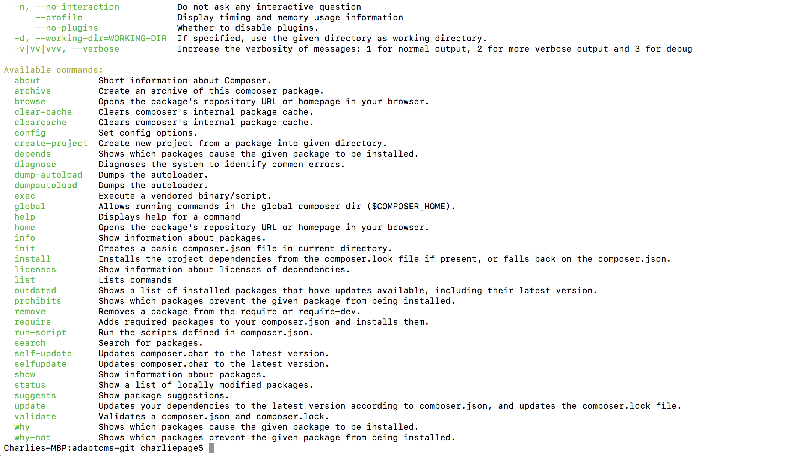

# Composer

So what is "Composer" to begin with? It's a PHP library that allows developers to easily include other PHP software in a project. With AdaptCMS, we use composer to pull in a framework and third-party libraries for many parts of the website. It auto-loads in these libraries and allows us to easily use those libraries quickly.

## How do I install it?

If your web server is running a newer version of Ubuntu, you should be able to install composer like this:

```text
sudo apt-get install composer
```

If that doesn't do the trick, check out this guide:

[**https://www.digitalocean.com/community/tutorials/how-to-install-and-use-composer-on-ubuntu-14-04**](https://www.digitalocean.com/community/tutorials/how-to-install-and-use-composer-on-ubuntu-14-04)

## Now what?

Okay, so if you type in "composer" into your terminal for your web server, you should see something like this:



If not, it may not be installed, see the above guide. If it is installed, navigate to the root of your site folder and run this command:

```text
composer update --lock
```

That should be it!

